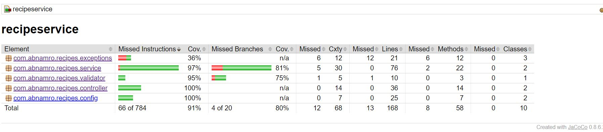

# recipeservice

### Assignment - Objective

Create a standalone java application which allows users to manage their favourite recipes. It should allow adding, updating, removing and fetching recipes. Additionally users should be able to filter available recipes based on one or more of the following criteria:

Whether or not the dish is vegetarian
The number of servings
Specific ingredients (either include or exclude)
Text search within the instructions.
For example, the API should be able to handle the following search requests:

All vegetarian recipes
Recipes that can serve 4 persons and have “potatoes” as an ingredient
Recipes without “salmon” as an ingredient that has “oven” in the instructions.

### Installation & Execution Steps

**Prerequisties**
* Java 11
* Maven 3.8.1

**Dependencies**
* Spring boot 2.7.12 - Spring Framework
* Swagger 2.9.2 - REST API Documentation (Swagger)
* lombok 1.18.28 - Java Library
* Jacoco Plugin 0.8.6 - Unit Test Coverage Plugin

### Execution

1. **Checkout the source code**
    ```
      git clone https://github.com/techragesh/recipeservice.git
      cd recipeservice
    ```

2. **Build the application**
    ```
    mvn clean install
    ```

3. **Run the application**
    ```
    mvn spring-boot:run
    ```
4. **Build the docker image**
    ```
    mvn spring-boot:build-image
    ```

### Run application through Docker Image

```
docker run -p 8090:8090 --name "recipes" recipes:1.0.0

```
  
### REST API Documentation

After running the application and browse the swagger api url

Swagger API Docs:

[http://localhost:8090/v2/api-docs](http://localhost:8090/v2/api-docs)

Swagger API URL:

[http://localhost:8090/swagger-ui.html](http://localhost:8090/swagger-ui.html)

### Screenshots





# Solution

I have implement recipe service and tried to make a production ready application. I've added rest api documentation, custom error handling, custom validators and did validation as much as possible.
I have added integration test and unit test for service and controller layers and covered with 91% code coverage. I used H2 database and made relations between recipe amd ingredient.
I might have added more like karate test, pipelines for CI/CD etc. As of now, We can build this application as docker image and deploy into docker container. I have provided all commands in the README.md

### Author
**Ragesh Sharma**

### Happy Coding